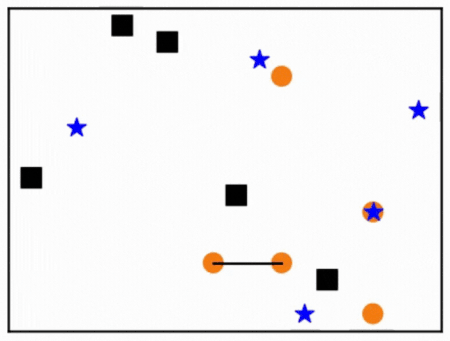

# Decentralized Multiagent Planning with Graph Neural Networks

This is the repository linked to the replication project done for the course "Machine Learning for Graph" @ VU Amsterdam.
The paper replicated is:"Graph Neural Networks for Decentralized Multi-Robot Path Planning" Qingbiao Li et al.
|            Test 1 (Success)            |
|:--------------------------------------:|


Slides from my presentation: [here](https://docs.google.com/presentation/d/1U5GJXuAFZTgo84--idJMGrxTX976u6J98tHx4gF_Jyw/edit?usp=sharing)
## Repository structure

```data_generation``` directory contains the files needed to create a dataset. A decentralized planner "Conflict Based Search" will generate trajectories in randomly generated gridmaps. This trajectories are parsed and ran through a gym environmnet to record the Local information of every agent before and after the actions.

To generate a new dataset run ``` python main_data.py``` and a dataset with 5 agents, in a 28 by 28 board with 8 obstacles will be generated. It will contain 1000 cases with the trajectories of every agent.

```grid``` contains the gym environment. ```env_graph_gridv1.py``` is the lates working version of the environment. It requires a config: ditc() containing board size[int,int], num_agents, min_time, max_time. More documentation about the params will be added soon.

```models``` directory includes the networks and frameworks. All frameworks include the CNN encoder + MLP action policy. Inside ```framework_gnn``` the ```class MessagePassing``` include the self importance aggregation method and ```class GCNLayer``` includes the Graph Convolutional Network using Espectral filters. Also ```class GCNNUMPy``` includes the forward pass of a GCN.

```cbs``` directory contains a implementation of the "Conflict Based Search" algorithm

Lastly ```train.py``` was used to train the network along with the config files in the ```configs``` directory.

## See an example

To see the framework in action, clone the repo and install ```requirement.txt``` with ```pip install -r requirement.txt```. Further support will include a proper environment.

```python example.py``` Will run a demostration with GCN, 5 agents in a 16x16 board and 8 obstacles.If you want to change the number of agents, obstacles, network or board size, go to ```configs``` and modify or create your own config. the available models are in the ```pretrained_models``` folder.


